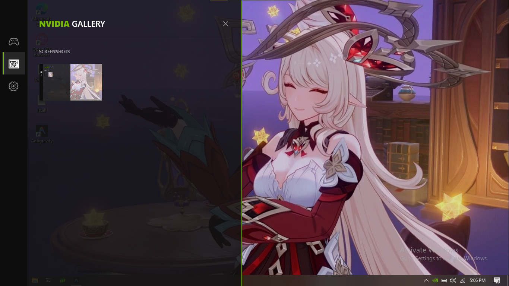

# 🎮 NVIDIA LITE (Beta) - Solusi Overlay Ringan Buat Kamu!

Halo! Selamat datang di **NVIDIA LITE**. Project ini saya buat karena pengen punya overlay yang super ringan, nggak ribet, tapi tetep kelihatan mewah pas lagi main game. Ini terinspirasi dari gaya _GeForce Now_ dan _Windows Game Bar_, tapi versi lebih "diet" dan estetik.

> ⚠️ **Catatan Penting**: Aplikasi ini statusnya masih **BETA**. Jadi kalau kamu nemu _bug_ atau ada yang aneh, maklumin ya! Saya masih terus poles biar makin mantap. Atau Bikin Issue di repo kami Terima kasih

---

## ✨ Kenapa Harus Pake Ini?

- **Tampilan Premium & Transparan**: Nggak nutupin layar game kamu. Efek kacanya bikin betah dilihat, apalagi di sisi kiri ala mac-style.
- **Animasi Super Halus**: Pas kamu pencet **Alt + Z**, sidebarnya muncul pelan-pelan (slide-in), nggak kaku kayak aplikasi jadul.
- **Dashboard Gaming Rapi**: Penataan game-nya kotak-kotak (grid) rapi. Nggak ada lagi daftar memanjang yang ngebosenin.
- **Auto-Filter Cerdas**: Saya udah setting biar aplikasi ini pinter bedain mana game beneran dan mana file sampah sistem. Jadi yang tampil cuma yang kamu butuhin aja!
- **Screenshot Sat-Set**: Cukup pencet **F10**, layar bakalan kedip putih (flash) tanda gambar udah diambil. Hasilnya langsung masuk folder Pictures kamu.
- **Klik Kanan Galeri**: Bisa langsung intip hasil screenshot, hapus yang jelek, atau simpan ke tempat lain cuma lewat klik kanan.

---

## 🚀 Cara Pasang & Mainkan

Aplikasi ini masih butuh sedikit "sentuhan tangan" buat jalaninnya.

### Prasyarat

- Kamu butuh **.NET 9.0 SDK** terpasang di Windows kamu.
- Pastikan Windows kamu 10 atau 11 (64-bit).

### Langkah-langkah (Contribution)

1. **Download atau Clone** folder ini ke komputer kamu.
2. Buka **Terminal/PowerShell** di folder project tersebut.
3. Jalankan:
   ```powershell
   dotnet build
   ```
4. Kalau udah beres, jalanin deh:
   ```powershell
   dotnet run
   ```

---

## ⌨️ Shortcut Rahasia

- **Alt + Z**: Buat buka/tutup jendela rahasia (Overlay).
- **F10**: Buat jepret layar (Screenshot) secara instan.

## 📁 Di mana file-nya disimpan?

- **Data Game**: Tersimpan aman di folder `%AppData%/Local/NvidiaCi`.
- **Hasil Foto**: Bisa kamu cek di folder `Pictures/Screenshots`.

---
## 🖼️ Contoh Screenshot

>  
>  
>  

---

_Dibuat dengan ❤️ oleh Zi._
